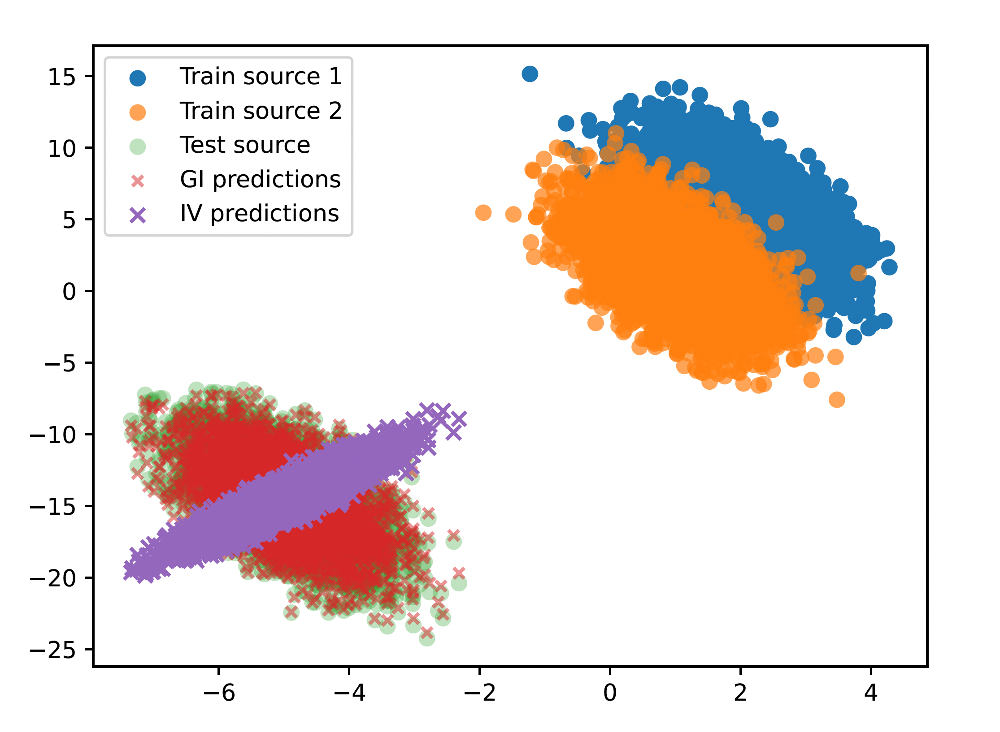

# Domain Adaptation under Hidden Confounding

Reference codebase implementation of the **Generative Invariance (GI)** estimator from  
*"Domain Adaptation under Hidden Confounding"* by Carlos García Meixide and David Ríos Insua.

---

## Repository contents

This repository contains the GI estimator and the scripts to reproduce the main simulation studies and the real-data experiment discussed in the paper.

### Files

- **`main.R`**  
  Implements the Generative Invariance (GI) estimator. 

- **`aux_gi.R`**  
  Helper functions for efficient environment-combination selection aimed at optimizing asymptotic variance.

- **`generate_6_2.R`**  
  Data-generating process used in the simulation setup of Section 6.2.

- **`sect6_4.R`**
  Reproduces the comparisons in Section 6.4 of the *Generative Invariance* paper. Compares GI, Causal Dantzig, and Instrumental Variables (IV) in terms of predictive accuracy in an unseen domain.

- **`sect6_6.R`**  
  Reproduces the analysis of the SPRINT trial in Section 6.6.  
  Requires access to the dataset available upon request at: <https://biolincc.nhlbi.nih.gov/login/?next=/requests/type/sprint/>

## Method summary

**Generative Invariance (GI)** leverages cross-environment structure to enable domain adaptation under hidden confounding. The estimator produces predictors that transfer effectively to unseen domains.

For full details and theoretical results, see the paper.

